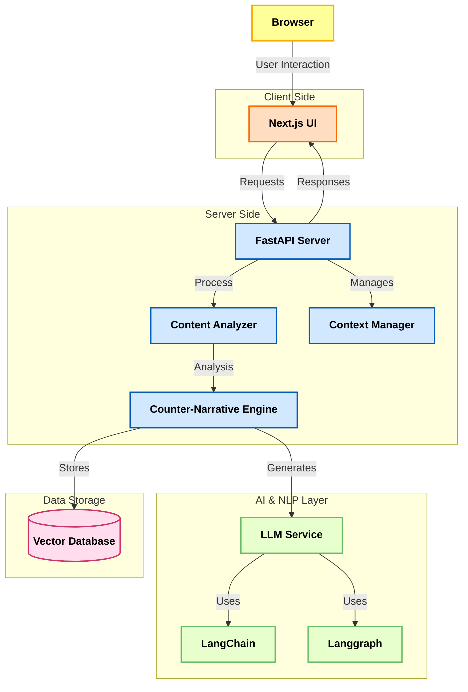
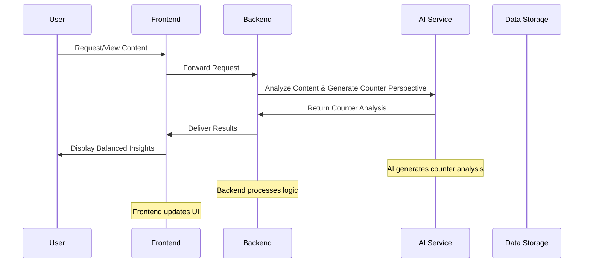

## Architecture Diagram

This document explains the internal design and workflow of Perspective.

Perspective follows a simple client–server architecture where:
- The frontend handles user interaction
- The backend processes content
- AI services generate counter-perspectives
- A vector database enables semantic retrieval

---

## Data Flow & Security

