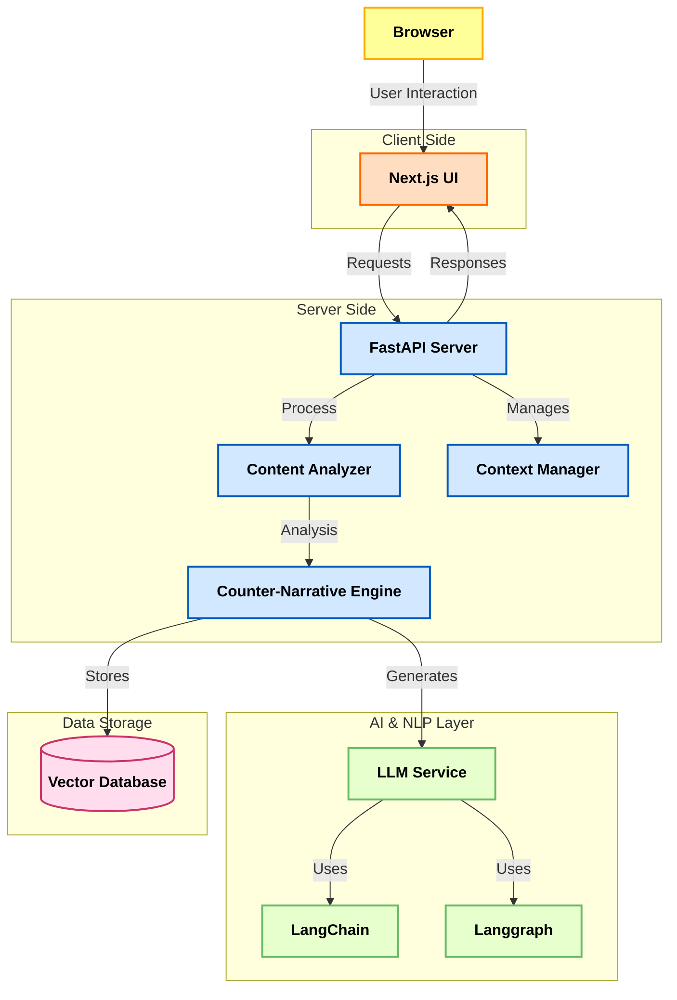
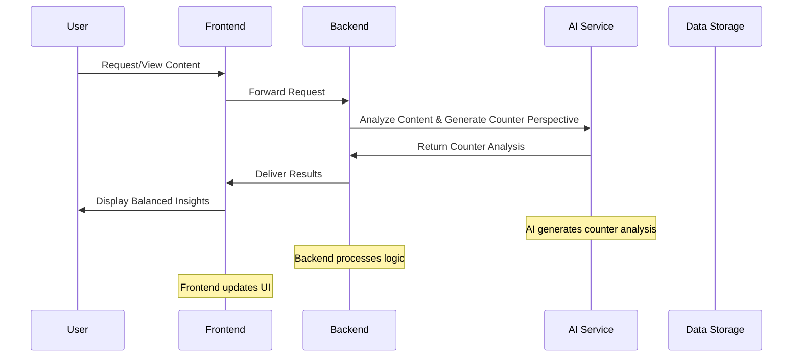

<div align="center">

# Perspective 
Fact-checked counter-perspectives powered by LLMs

</div>


---

## System Overview

Perspective-AI is designed to combat the echo chambers created by personalized content algorithms. It actively curates counterarguments and alternative narratives from credible sources alongside the content you usually see. Whether it’s a news article, blog post, or social media update, Perspective-AI analyzes the existing narrative and presents a balanced, in-depth counter-perspective. This approach not only challenges your current viewpoints but also helps broaden your understanding of complex issues—all in real time.

## High-Level Concept
Imagine having a smart, opinionated friend who isn’t afraid to challenge your beliefs with well-articulated counterpoints—that’s Perspective-AI in a nutshell!

---

## Quick Setup

### Prerequisites

- Node.js 18+
- Python 3.10+
- uv package manager → https://docs.astral.sh/uv/
- API keys:
  - Groq/OpenAI API key
  - Pinecone API key
  - Google Custom Search API key
  - (Optional) HuggingFace access token

### Frontend Setup

```bash
cd frontend
cp .env.example .env
npm install
npm run dev
```
### Backend Setup

```bash
cd backend
cp .env.example .env
uv sync
uv run main.py
```
---

## Tech Stack

<table>
<tr>
<th align="center">Frontend</th>
<th align="center">Backend</th>
<th align="center">AI & NLP</th>
<th align="center">Database</th>
</tr>

<tr>
<td align="center">
  <br/>
  <b>Next.js</b>
</td>

<td align="center">
  <br/>
  <b>FastAPI</b>
</td>

<td align="center">
  <br/>
  <b>OpenAI / LLM APIs</b>
</td>

<td align="center">
<br/>
  <b>Vector DB</b>
</td>
</tr>


<tr>
<td align="center">
  <br/>
  <b>TailwindCSS</b>
</td>

<td align="center">
  <br/>
  <b>Python</b>
</td>

<td align="center">
  <br/>
  <b>LangChain / LangGraph</b>
</td>

<td align="center">
  Embeddings Storage
</td>
</tr>

<tr>
<td align="center">
  Responsive UI
</td>

<td align="center">
  REST APIs
</td>

<td align="center">
  Prompt Engineering
</td>

<td align="center">
  Semantic Search
</td>
</tr>

</table>

---

## Core Features

### 1. Counter-Perspective Generation
- **What It Does**: Instantly displays counterarguments to the main narrative.
- **How It Works**: Analyzes content to identify biases and generates alternative viewpoints.


### 2. Reasoned Thinking
- **What It Does**: Breaks down narratives into logical, connected arguments.
- **How It Works**: Uses chain-of-thought prompting and connected fact analysis.

### 3. Updated Facts
- **What It Does**: Provides real-time updates and the latest facts along with counter-narratives.
- **How It Works**: Continuously pulls data from trusted sources and updates the insights.

### 4. Seamless Integration
- **What It Does**: Integrates effortlessly with existing news, blogs, and social media platforms.
- **How It Works**: Uses custom integration modules and API endpoints.

### 5. Real-Time Analysis
- **What It Does**: Generates insights instantly as you browse.
- **How It Works**: Employs real-time processing powered by advanced AI.

---


## Architecture Diagram



### Components

- **1. Frontend (Next.js)** – User interface for submitting articles and viewing generated perspectives
- **2. FastAPI Backend** – Handles requests, orchestration, and API responses
- **3. Content Analyzer** – Extracts key points and identifies narrative bias
- **4. Counter-Narrative Engine** – Generates alternative viewpoints using AI
- **5. LLM Service (LangChain/LangGraph)** – Runs reasoning workflows and text generation
- **6. Vector Database** – Stores embeddings for semantic retrieval
---


## Data Flow & Security


---

## Expected Outcomes

- **Less Bias in Narratives**: Break out of echo chambers and question prevailing narratives.
- **Wider Perspectives**: Broaden your understanding of complex issues.
- **Better Discourse**: Enable balanced, informed discussions.
- **Sharper Analysis**: Improve critical thinking by comparing connected facts and counter-facts.

---

## Required Skills

- **Frontend Development**:  Experience with Next.js and modern UI frameworks.
- **Backend Development**: Proficiency in Python and FastAPI.
- **AI & NLP**: Familiarity with LangChain, Langgraph, and prompt engineering techniques.
- **Database Management**: Knowledge of vector databases system.

---
